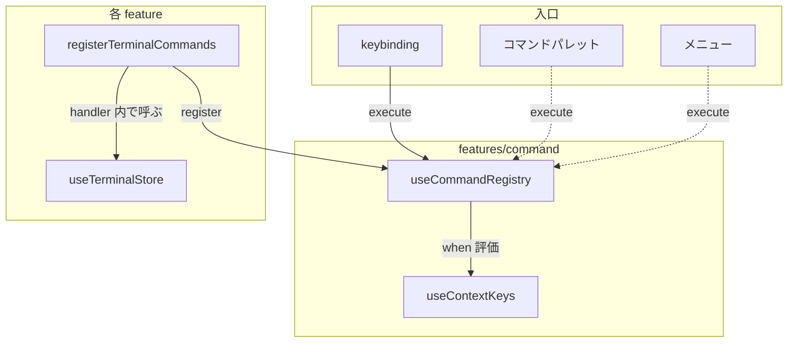

# Command

コマンドシステム。ID → handler のレジストリで、keybinding・コマンドパレット・メニュー等の複数の入口から統一的にコマンドを実行する。

## アーキテクチャ



> [!NOTE]
> 破線はまだ未実装の入口

## コマンドレジストリ

`useCommandRegistry()`（module singleton）でコマンドを登録・実行する。

```typescript
interface CommandRegistry {
  register(id: string, handler: CommandHandler): () => void;
  execute(id: string, args?: unknown): boolean;
  reset(): void;
}
```

- `register()` は dispose 関数を返す。同一 ID の二重登録は上書き（HMR 安全）
- `execute()` は handler を `tryCatch` でラップして実行する。handler 内で例外が発生した場合は `console.error` で記録し `false` を返す。未登録なら `false`
- dispose 時は `handlers.get(id) === handler` で一致チェックし、他の登録を壊さない

### CommandHandler

```typescript
type CommandHandler = (args?: unknown) => boolean;
```

処理した場合 `true`、何もしなかった場合 `false` を返す。呼び出し元はこの戻り値で `preventDefault` 等を判断する。

### コマンド登録の例

```typescript
// features/terminal/registerTerminalCommands.ts
const disposers = [
  registry.register("terminal.splitHorizontal", () => {
    const active = getActiveLayout();
    if (active === undefined) return false;
    terminalStore.splitPane(active.dir, "horizontal");
    return true;
  }),
  // ...
];

// dispose 関数を返す
return () => {
  for (const d of disposers) d();
};
```

## Context Key

`useContextKeys()`（module singleton）で when 条件の評価に使う状態を管理する。

```typescript
interface ContextMap {
  terminalFocus: boolean;
  explorerVisible: boolean;
}
```

| キー名            | source                                                                    |
| ----------------- | ------------------------------------------------------------------------- |
| `terminalFocus`   | xterm の focus/blur + worktree 切替 / closePane / visibilitychange で更新 |
| `explorerVisible` | MainLayout の `watchEffect` で `explorerOpen && canDockExplorer` を同期   |

### When 条件

内部では typed AST（`When` 型）で表現する。外部入力（JSON 設定等）は文字列で受け取り、`parseWhen()` で AST に変換する。

```
terminalFocus
terminalFocus && !explorerVisible
terminalFocus && explorerVisible || otherKey
```

- `&&` は `||` より結合が強い
- 括弧はサポートしない（VS Code 互換）
