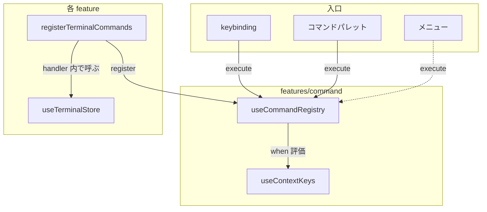

# Command

コマンドシステム。ID → handler のレジストリで、keybinding・コマンドパレット・メニュー等の複数の入口から統一的にコマンドを実行する。

## アーキテクチャ



> [!NOTE]
> 破線はまだ未実装の入口

## コマンドレジストリ

`useCommandRegistry()`（module singleton）でコマンドを登録・実行する。

```typescript
interface CommandRegistry {
  register(id: string, input: CommandInput): () => void;
  execute(id: string, args?: unknown): boolean;
  listForPalette(): readonly CommandEntry[];
  reset(): void;
}
```

- `register()` は dispose 関数を返す。同一 ID の二重登録は上書き（HMR 安全）
- `execute()` は handler を `tryCatch` でラップして実行する。handler 内で例外が発生した場合は `console.error` で記録し `false` を返す。未登録なら `false`
- `listForPalette()` は label が設定されているコマンドのみを返す。コマンドパレット UI が使用する
- dispose 時は一致チェックし、他の登録を壊さない

### CommandInput

`register()` の第2引数はハンドラ関数、または label 付き記述子を受け取る。

```typescript
type CommandHandler = (args?: unknown) => boolean;

interface CommandDescriptor {
  label: string; // コマンドパレットに表示する名前
  handler: CommandHandler;
}

type CommandInput = CommandHandler | CommandDescriptor;
```

- `label` 付きで登録したコマンドのみコマンドパレットに表示される
- `label` なし（関数のみ）のコマンドはパレットに表示されない（引数付きコマンド等）
- handler は処理した場合 `true`、何もしなかった場合 `false` を返す。呼び出し元はこの戻り値で `preventDefault` 等を判断する

### コマンド登録の例

```typescript
// label 付き: コマンドパレットに表示される
registry.register("terminal.splitHorizontal", {
  label: "Terminal: Split Horizontal",
  handler: () => {
    const active = getActiveLayout();
    if (active === undefined) return false;
    terminalStore.splitPane(active.dir, "horizontal");
    return true;
  },
});

// label なし: コマンドパレットに表示されない（引数付きコマンド）
registry.register("workspace.selectWorktree", (args) => {
  if (typeof args !== "number") return false;
  // ...
  return true;
});
```

## Context Key

`useContextKeys()`（module singleton）で when 条件の評価に使う状態を管理する。

```typescript
interface ContextMap {
  terminalFocus: boolean;
  previewVisible: boolean;
  commandPaletteVisible: boolean;
}
```

| キー名                  | source                                                                            |
| ----------------------- | --------------------------------------------------------------------------------- |
| `terminalFocus`         | xterm の focus/blur + worktree 切替 / closePane / visibilitychange で更新         |
| `previewVisible`        | MainLayout の `watchEffect` で `previewOpen` を同期（Preview popover の開閉状態） |
| `commandPaletteVisible` | CommandPalette の show/close で更新                                               |

### When 条件

内部では typed AST（`When` 型）で表現する。外部入力（JSON 設定等）は文字列で受け取り、`parseWhen()` で AST に変換する。

```text
terminalFocus
terminalFocus && !previewVisible
terminalFocus && previewVisible || otherKey
```

- `&&` は `||` より結合が強い
- 括弧はサポートしない（VS Code 互換）
