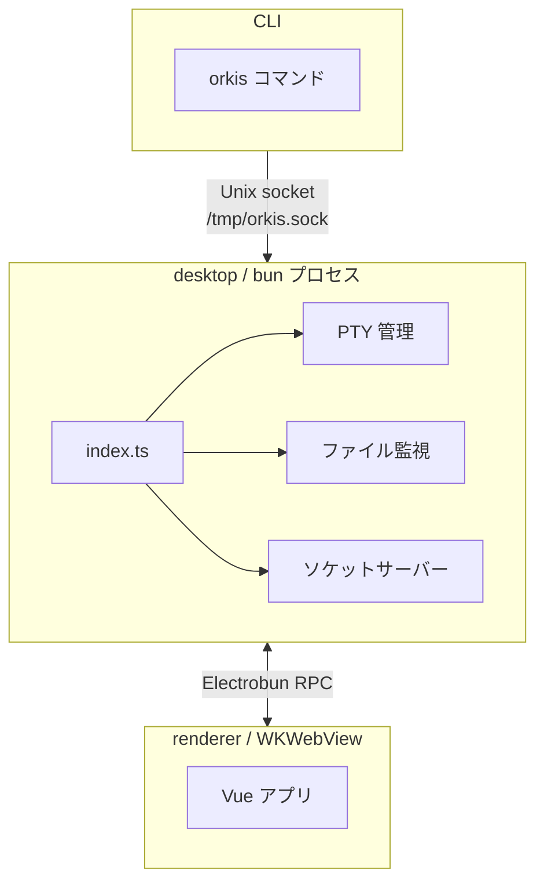

# Electrobun

Bun ランタイム + WKWebView のデスクトップアプリフレームワーク。Electron の代替として採用。

## 選択理由

- Bun ランタイムで起動が高速
- `Bun.spawn({ terminal })` で PTY をネイティブサポート（node-pty 不要）
- 型安全な RPC（`ElectrobunRPCSchema`）で bun ↔ webview 間通信が宣言的に書ける
- WKWebView ベースで軽量

## アーキテクチャ

## WKWebView の制約

- `file://` URL をブロック → desktop 側でローカル HTTP ファイルサーバー（`Bun.serve()`）を起動し、`http://localhost:{port}/{windowId}/{relPath}` で配信
- `window.open()` が機能しない → RPC の `openExternal` 経由で `Utils.openExternal()` を呼ぶ

## ビルド構成

- **dev**: Vite HMR サーバー（`localhost:5173`）を WKWebView で表示
- **build**: renderer を Vite でビルドし、成果物を `views/main/` にコピー
- **views エントリポイント**: `src/placeholder.ts`（空ファイル。実際の UI は renderer の build 成果物）

## ウィンドウ管理

- ディレクトリごとに1ウィンドウ（同じディレクトリの重複不可）
- `windowDirs` Map で dir → ウィンドウの対応を管理
- ウィンドウ close 時に全リソース（PTY, watcher, timer）をクリーンアップ
- `exitOnLastWindowClosed: true` で最後のウィンドウを閉じるとアプリ終了

## シングルインスタンス制御

- 起動時に `/tmp/orkis.sock` への接続を試行
- 接続成功 → 既存インスタンスが存在 → exit
- 接続失敗 → 残骸ソケットを削除して新規起動

## セキュリティ

- `resolveSecurePath()`: `realpath` + `relative` でパストラバーサルを防止
- `assertInsideRoot()`: git 操作用の軽量チェック（realpath なし）
- `isAllowedProtocol()`: 外部 URL は `https:` / `http:` のみ許可
