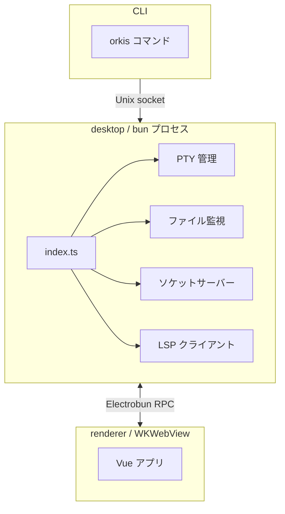

# Electrobun

Bun ランタイム + WKWebView のデスクトップアプリフレームワーク。Electron の代替として採用。

## 選択理由

- Bun ランタイムで起動が高速
- `Bun.spawn({ terminal })` で PTY をネイティブサポート（node-pty 不要）
- 型安全な RPC（`ElectrobunRPCSchema`）で bun ↔ webview 間通信が宣言的に書ける
- WKWebView ベースで軽量

## アーキテクチャ

## WKWebView の制約

- `file://` URL をブロック → desktop 側でローカル HTTP ファイルサーバー（`Bun.serve()`）を起動して配信
  - `/{windowId}/fs/{relPath}` — 現在のファイル
  - `/{windowId}/git/{relPath}` — HEAD 時点のファイル（`git show`）
  - バイナリ判定: NUL バイト + 1MB サイズ制限
  - Content-Type は `Bun.file().type` から自動推定
- `window.open()` が機能しない → RPC の `openExternal` 経由で `Utils.openExternal()` を呼ぶ

## ビルド構成

- **dev**: Vite HMR サーバー（`localhost:5173`）を WKWebView で表示
- **build**: renderer を Vite でビルドし、成果物を `views/main/` にコピー
- **views エントリポイント**: `src/placeholder.ts`（空ファイル。実際の UI は renderer の build 成果物）

## ウィンドウ管理

- ディレクトリごとに1ウィンドウ（同じディレクトリの重複不可）
- `windowDirs` Map で dir → ウィンドウの対応を管理
- `repoRootDir`（clone 元、固定）と `currentDir`（切り替え可能な worktree パス）を分離
- ウィンドウ close 時に全リソース（PTY, watcher, timer, LSP）をクリーンアップ
- `exitOnLastWindowClosed: true` で最後のウィンドウを閉じるとアプリ終了

### Worktree 切り替え（switchDir）

ウィンドウを閉じずに表示対象ディレクトリを切り替える。切り替え時の処理:

- ファイル監視の付け替え（stopWatching → startWatching）
- LSP クライアントの再起動
- 世代番号（`windowSwitchGen`）のインクリメントで stale な結果を破棄

### 非アクティブ worktree 監視

アクティブでない worktree の `.git/index` を `fs.watchFile` で監視し、ファイル変更を検知して `worktreeChange` メッセージを送信する。`syncWorktreeWatchers()` でアクティブ/非アクティブの切り替えに応じてウォッチャーを動的に管理する。

## 起動フロー

launcher（main.zig）は bun を固定引数（`./bun`, `Resources/main.js`）で起動する。`open --args` の引数は bun の `process.argv` に転送されない。

### 起動パターン

| 起動方法                   | 動作                                                                                 |
| -------------------------- | ------------------------------------------------------------------------------------ |
| 開発用 `bin/orkis`         | `ORKIS_PROJECT_ROOT` 環境変数で即座にウィンドウを開く                                |
| `.app` 内 CLI（`orkis .`） | `open` でアプリ起動 → ソケット待ち → CLI が open メッセージを送信 → ウィンドウが開く |
| Dock/Finder                | 1秒待っても open メッセージが届かなければホームディレクトリで開く                    |

### ソケット通信

- ソケットパスは `/tmp/orkis-stable.sock` 固定（`Updater.localInfo.channel()` は `build:stable` で `"stable"` を返す）
- CLI → アプリへのメッセージ: `open`（dir, file）、`hook`（event, payload）
- open メッセージの dir は `git rev-parse --show-toplevel` で repo root に解決される
- 残骸ソケットの検出には `echo "" | nc -U`（macOS デフォルトの `nc -zU` では Node.js ソケットへの接続テストが失敗する）

### シングルインスタンス制御

- 起動時に既存ソケットへの接続を試行
- 接続成功 → 既存インスタンスが存在 → exit
- 接続失敗 → 残骸ソケットを削除して新規起動

## セキュリティ

- `resolveSecurePath()`: `realpath` + `relative` でパストラバーサルを防止
- `assertInsideRoot()`: git 操作用の軽量チェック（realpath なし）
- `isAllowedProtocol()`: 外部 URL は `https:` / `http:` のみ許可
