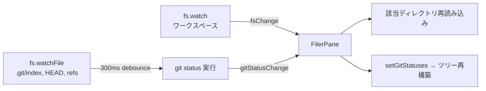

# Filer

ワークスペースのファイルツリーを表示し、git status に応じた色分けとアイコンを提供する。

## 構成

```
features/filer/
├── FilerPane.vue          # ルートペイン（ツリーの読み込み、fsChange/gitStatusChange の購読）
├── FileTreeItem.vue       # 再帰ツリーアイテム（展開/折りたたみ、アイコン、git 色分け）
├── filer-utils.ts         # git status 解決、削除エントリ生成、ソート
├── useFileIcon.ts         # material-icon-theme によるアイコン解決
├── useGitStatusStore.ts   # git status のリアクティブ状態管理（Pinia store）
└── useWorkspaceStore.ts   # ワークスペース・選択パスの管理（Pinia store）
```

## データフロー



- `fsChange`: ワークスペース内のファイル変更通知（`.git/` と `node_modules/` は除外）
- `gitStatusChange`: `git status --porcelain=v1` の結果をプッシュ通知（300ms デバウンス）
- `.git` 関連ファイルは `fs.watchFile`（ポーリング 500ms）で個別監視

### git status 変更時の children 再構築

git status が更新されると、削除仮想エントリの追加/除去のためにルートを再構築する。展開中の子ディレクトリの `children` キャッシュも破棄し、`notifyGitStatusChange()` で展開中のすべての子ツリーを再構築する。

## ツリー自動展開（reveal）

ファイル選択時に、対象パスまでツリーを自動展開してスクロールインビューする。

- `FilerPane.reveal(targetPath)` がルートエントリから先頭セグメントを探し、`FileTreeItem.reveal` に委譲
- `FileTreeItem.reveal(targetPath)` がパスセグメントを再帰的に辿り、各ディレクトリを非同期で展開（未読み込みなら `loadChildren()` を await）
- 最終ノードに到達したら `scrollIntoView({ block: "nearest" })` でスクロール
- `MainLayout` が `selectedPath` の変更を watch し、Explorer 自動オープンと合わせて `reveal` を呼び出す

## git status の色分け

`git status --porcelain=v1` のステータスコード（2文字）から変更種別を判定する。worktree 側（Y）を優先し、なければ index 側（X）を使う。

| 種別      | 色     | 対象コード |
| --------- | ------ | ---------- |
| modified  | yellow | `M`        |
| added     | green  | `A`        |
| deleted   | red    | `D`        |
| untracked | green  | `??`       |
| renamed   | blue   | `R`, `C`   |

ディレクトリの色は配下の変更種別から推論する。全て同一種別ならその色、混在なら modified（yellow）。

## 削除ファイルの表示

`git status` で `D` ステータスのファイルは、ディスク上に存在しないがツリーに仮想エントリとして表示する。`getDeletedEntries()` がディレクトリ直下の削除ファイル/サブディレクトリを生成する。

## ファイルアイコン

`material-icon-theme` の `generateManifest()` から解決マップを構築する。

解決優先順位:

- ファイル名完全一致（`Dockerfile`, `.gitignore` 等）
- 拡張子一致（複合拡張子対応: `.test.ts` → `test.ts` → `ts`）
- 拡張子 → VS Code 言語 ID → アイコン名（`EXTENSION_LANGUAGE_ID_MAP` で変換）
- デフォルトアイコン

SVG は `import.meta.glob` で一括取り込み、Vite がビルド時にハッシュ付きパスに変換する。`assetsInlineLimit: 0` で SVG のインライン化を防止している。

## useWorkspaceStore

ワークスペースの状態を管理する Pinia store。`dir`, `selectedPath`, `fileServerBaseUrl`, `channel` を保持する。

- `setOpen()` で orkisOpen メッセージの初期化データを受け取る
- `selectedPath` と `selectedGitChange` を管理し、ファイラーとプレビュー間でパス情報を共有する
- `selectedGitChange` は `gitStatuses` から `computed` で都度算出するため、git status 更新時にプレビューのタブ状態も自動反映される
