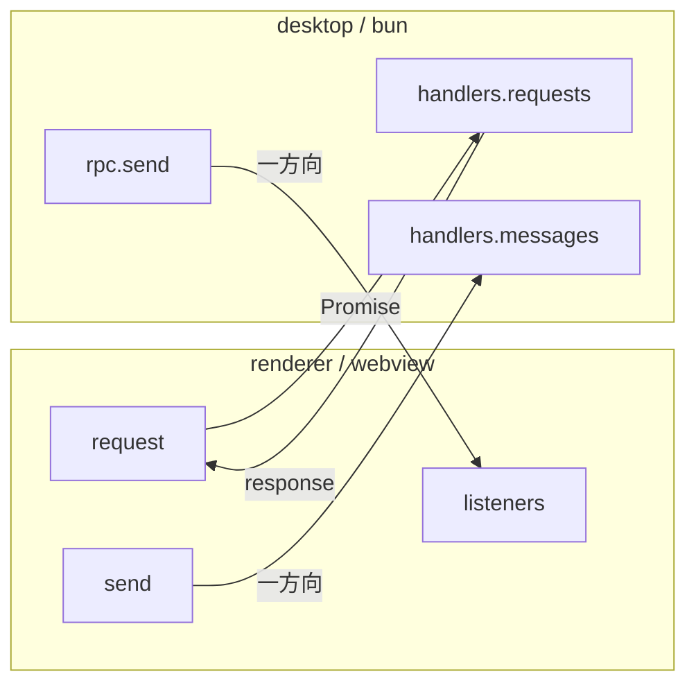

# RPC

Electrobun RPC による型安全な bun（desktop）↔ webview（renderer）間通信。スキーマは `packages/rpc` で定義する。

## 通信モデル



## Request（renderer → desktop、Promise ベース）

| Request                  | params                        | response                     | 用途                                               |
| ------------------------ | ----------------------------- | ---------------------------- | -------------------------------------------------- |
| `ptySpawn`               | `{ dir, cols, rows }`         | `number`                     | PTY 起動、ID を返す                                |
| `fsReadDir`              | `{ relPath }`                 | `FileEntry[]`                | ディレクトリ読み込み                               |
| `fsReadFile`             | `{ relPath }`                 | `FileReadResult`             | ファイル読み込み                                   |
| `fsReadFileAbsolute`     | `{ absolutePath }`            | `FileReadResult`             | 絶対パスでファイル読み取り（ワークスペース外）     |
| `gitShowFile`            | `{ relPath }`                 | `FileReadResult`             | HEAD 時点のファイル内容                            |
| `gitDiffFile`            | `{ relPath }`                 | `string`                     | unified diff                                       |
| `gitStatus`              | —                             | `Record<string, string>`     | git status 全体                                    |
| `gitLog`                 | `{ maxCount? }`               | `GitCommit[]`                | コミット履歴（現在ブランチ + main）                |
| `gitWorktreeList`        | —                             | `WorktreeEntry[]`            | worktree 一覧を取得                                |
| `gitBranchList`          | —                             | `string[]`                   | ローカルブランチ一覧を取得                         |
| `createWorktree`         | `{ worktreeDir, branch }`     | `WorktreeEntry`              | worktree を作成                                    |
| `createWorktreeWithTodo` | `{ id, worktreeDir, branch }` | `{ todo, worktree }`         | Todo に worktree を作成して紐づける                |
| `gitWorktreeRemove`      | `{ path, force? }`            | `void`                       | worktree を解除（ブランチは残る）                  |
| `gitBranchDelete`        | `{ branch }`                  | `void`                       | ローカルブランチを削除                             |
| `switchDir`              | `{ dir }`                     | `{ dir, fileServerBaseUrl }` | 表示対象ディレクトリを切り替え（worktree 選択）    |
| `configLoad`             | —                             | `AppConfig`                  | グローバル設定を読み込む                           |
| `configSave`             | `AppConfig`                   | `void`                       | グローバル設定を保存する                           |
| `voicevoxLaunch`         | —                             | `boolean`                    | VOICEVOX Engine を起動（未インストールなら false） |

## Message（一方向）

### desktop → renderer

| Message           | Payload                                                | 用途                                       |
| ----------------- | ------------------------------------------------------ | ------------------------------------------ |
| `ptyData`         | `{ id, data }`                                         | PTY 出力                                   |
| `ptyExit`         | `{ id, exitCode }`                                     | PTY 終了                                   |
| `fsChange`        | `{ relDir }`                                           | ファイル変更通知                           |
| `gitStatusChange` | `{ statuses }`                                         | git status 変化                            |
| `worktreeChange`  | `void`                                                 | 非アクティブ worktree でのファイル変更通知 |
| `gozdOpen`        | `{ dir, file?, fileServerBaseUrl, channel, repoName }` | ウィンドウ open                            |
| `gozdHook`        | `{ event, payload }`                                   | Claude Code Hook イベント                  |
| `lspDiagnostics`  | `FileDiagnostics`                                      | LSP 型診断結果                             |

### renderer → desktop

| Message         | Payload              | 用途                      |
| --------------- | -------------------- | ------------------------- |
| `ptyWrite`      | `{ id, data }`       | ユーザー入力を PTY に送信 |
| `ptyResize`     | `{ id, cols, rows }` | PTY リサイズ              |
| `ptyKill`       | `{ id }`             | PTY 終了                  |
| `openExternal`  | `{ url }`            | 外部 URL を開く           |
| `windowClose`   | —                    | ウィンドウを閉じる        |
| `rendererReady` | —                    | renderer 初期化完了       |

## 型定義

```typescript
interface FileEntry {
  name: string;
  isDirectory: boolean;
  isIgnored: boolean;
}

interface FileReadResult {
  content: string;
  isBinary: boolean;
}

interface WorktreeChangeCounts {
  modified: number;
  added: number;
  deleted: number;
  untracked: number;
}

interface WorktreeEntry {
  path: string;
  head: string;
  branch?: string;
  isMain: boolean;
  changeCounts?: WorktreeChangeCounts;
}

interface GitCommit {
  hash: string;
  shortHash: string;
  parents: string[];
  author: string;
  date: number; // Unix timestamp
  message: string;
  refs: string[]; // ブランチ名、タグ、HEAD 等
}

interface LspDiagnostic {
  startLine: number;
  startCharacter: number;
  endLine: number;
  endCharacter: number;
  message: string;
  severity: number; // 1=error, 2=warning, 3=info, 4=hint
}

interface FileDiagnostics {
  relPath: string;
  diagnostics: LspDiagnostic[];
}

interface VoicevoxConfig {
  enabled: boolean;
  speedScale: number;
  volumeScale: number;
}

interface AppConfig {
  voicevox?: VoicevoxConfig;
}
```

## Renderer 側の購読パターン

`useRpc()` composable が disposer パターンでリスナー登録を提供する。

```typescript
const unsubscribe = onFsChange(({ relDir }) => { ... });
onUnmounted(unsubscribe);
```
