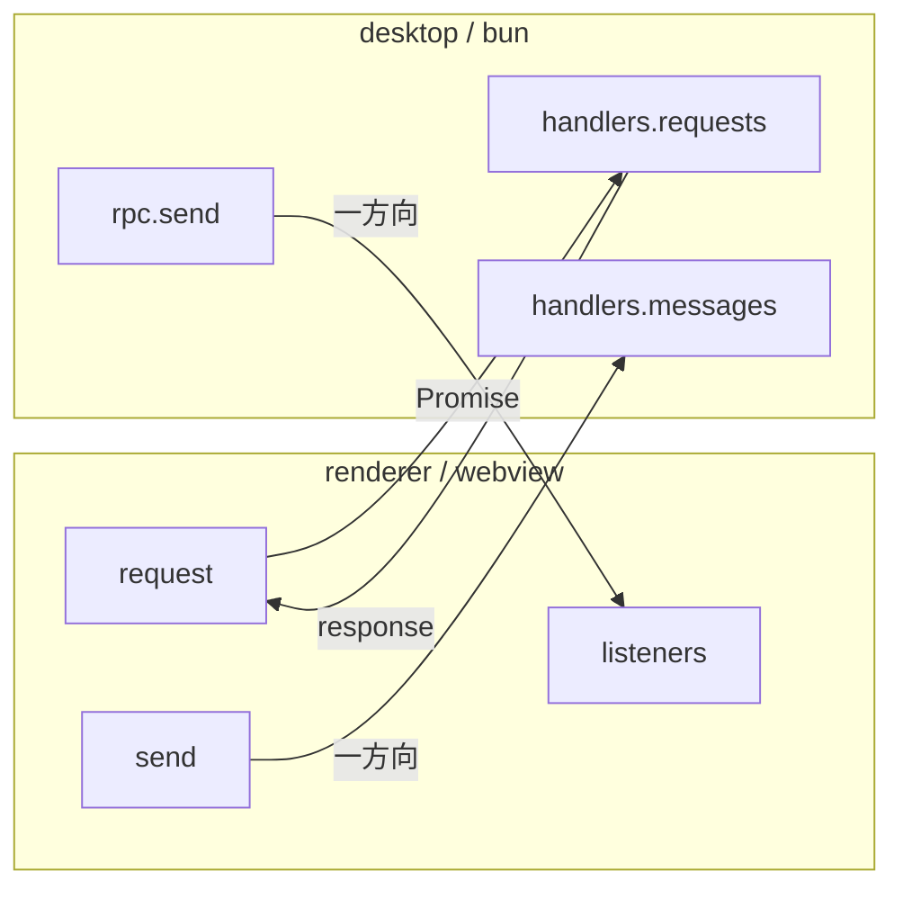

# RPC

Electrobun RPC による型安全な bun（desktop）↔ webview（renderer）間通信。スキーマは `packages/rpc` で定義する。

## 通信モデル



## Request（renderer → desktop、Promise ベース）

| Request                  | 用途                                               |
| ------------------------ | -------------------------------------------------- |
| `ptySpawn`               | PTY 起動、ID を返す                                |
| `fsReadDir`              | ディレクトリ読み込み                               |
| `fsReadFile`             | ファイル読み込み                                   |
| `fsReadFileAbsolute`     | 絶対パスでファイル読み取り（ワークスペース外）     |
| `gitShowFile`            | HEAD 時点のファイル内容                            |
| `gitShowCommitFile`      | コミット間のファイル内容（from/to を一括取得）     |
| `gitDiffFile`            | unified diff                                       |
| `gitStatus`              | git status 全体                                    |
| `gitLog`                 | コミット履歴（HEAD 系統 + デフォルトブランチ系統） |
| `gitWorktreeList`        | worktree 一覧を取得                                |
| `gitBranchList`          | ローカルブランチ一覧を取得                         |
| `createWorktree`         | worktree を作成                                    |
| `createWorktreeWithTodo` | Todo に worktree を作成して紐づける                |
| `gitWorktreeRemove`      | worktree を解除（ブランチは残る）                  |
| `gitBranchDelete`        | ローカルブランチを削除                             |
| `switchDir`              | 表示対象ディレクトリを切り替え（worktree 選択）    |
| `configLoad`             | グローバル設定を読み込む                           |
| `configSave`             | グローバル設定を保存する                           |
| `voicevoxLaunch`         | VOICEVOX Engine を起動（未インストールなら false） |

## Message（一方向）

### desktop → renderer

| Message           | 用途                                       |
| ----------------- | ------------------------------------------ |
| `ptyData`         | PTY 出力                                   |
| `ptyExit`         | PTY 終了                                   |
| `fsChange`        | ファイル変更通知                           |
| `gitStatusChange` | git status 変化 + HEAD ハッシュ            |
| `worktreeChange`  | 非アクティブ worktree でのファイル変更通知 |
| `gozdOpen`        | ウィンドウ open                            |
| `gozdHook`        | Claude Code Hook イベント                  |
| `errorNotify`     | desktop 側のバックグラウンドエラー通知     |

### renderer → desktop

| Message         | 用途                      |
| --------------- | ------------------------- |
| `ptyWrite`      | ユーザー入力を PTY に送信 |
| `ptyResize`     | PTY リサイズ              |
| `ptyKill`       | PTY 終了                  |
| `openExternal`  | 外部 URL を開く           |
| `windowClose`   | ウィンドウを閉じる        |
| `rendererReady` | renderer 初期化完了       |

> [!NOTE]
> params / response / payload の型定義は `packages/rpc/src/index.ts` を参照。

## Renderer 側の購読パターン

`useRpc()` composable が disposer パターンでリスナー登録を提供する。

```typescript
const unsubscribe = onFsChange(({ relDir }) => { ... });
onUnmounted(unsubscribe);
```
