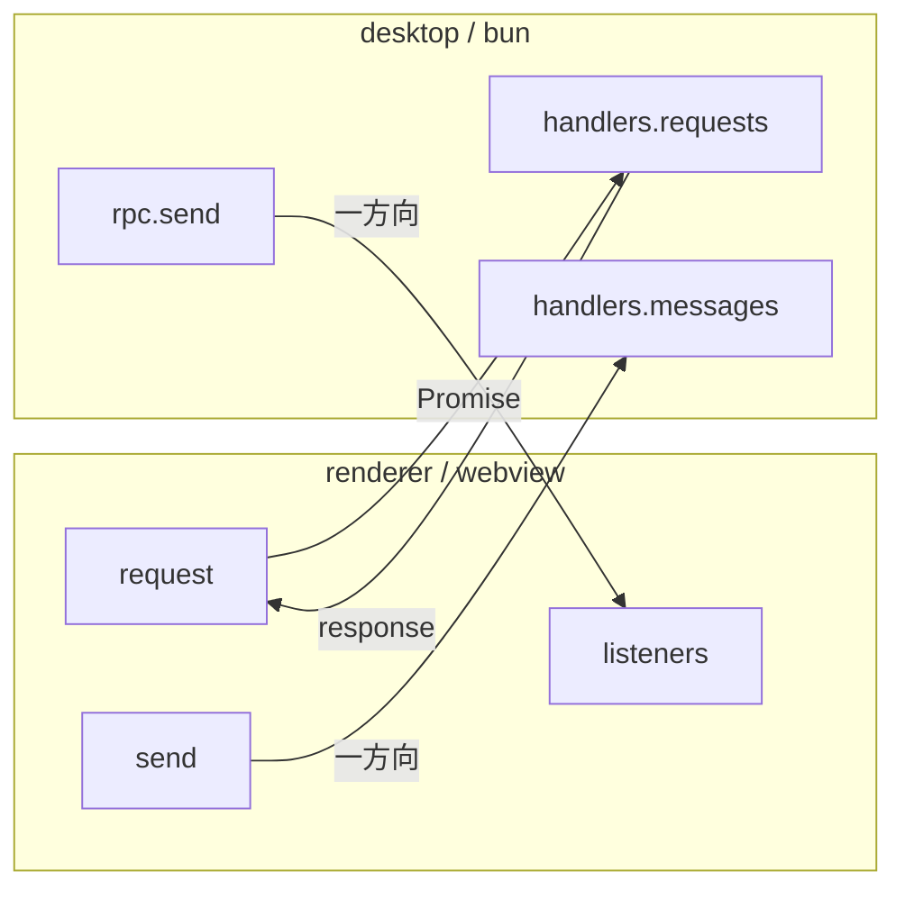

# RPC

Electrobun RPC による型安全な bun（desktop）↔ webview（renderer）間通信。スキーマは `packages/rpc` で定義する。

## 通信モデル



## Request（renderer → desktop、Promise ベース）

| Request       | params           | response                 | 用途                    |
| ------------- | ---------------- | ------------------------ | ----------------------- |
| `ptySpawn`    | `{ cols, rows }` | `number`                 | PTY 起動、ID を返す     |
| `fsReadDir`   | `{ relPath }`    | `FileEntry[]`            | ディレクトリ読み込み    |
| `fsReadFile`  | `{ relPath }`    | `FileReadResult`         | ファイル読み込み        |
| `gitShowFile` | `{ relPath }`    | `FileReadResult`         | HEAD 時点のファイル内容 |
| `gitDiffFile` | `{ relPath }`    | `string`                 | unified diff            |
| `gitStatus`   | —                | `Record<string, string>` | git status 全体         |

## Message（一方向）

### desktop → renderer

| Message           | Payload                             | 用途                      |
| ----------------- | ----------------------------------- | ------------------------- |
| `ptyData`         | `{ id, data }`                      | PTY 出力                  |
| `ptyExit`         | `{ id, exitCode }`                  | PTY 終了                  |
| `fsChange`        | `{ relDir }`                        | ファイル変更通知          |
| `gitStatusChange` | `{ statuses }`                      | git status 変化           |
| `orkisOpen`       | `{ dir, file?, fileServerBaseUrl }` | ウィンドウ open           |
| `orkisHook`       | `{ event, payload }`                | Claude Code Hook イベント |
| `lspDiagnostics`  | `FileDiagnostics`                   | LSP 型診断結果            |

### renderer → desktop

| Message         | Payload              | 用途                      |
| --------------- | -------------------- | ------------------------- |
| `ptyWrite`      | `{ id, data }`       | ユーザー入力を PTY に送信 |
| `ptyResize`     | `{ id, cols, rows }` | PTY リサイズ              |
| `ptyKill`       | `{ id }`             | PTY 終了                  |
| `openExternal`  | `{ url }`            | 外部 URL を開く           |
| `rendererReady` | —                    | renderer 初期化完了       |

## 型定義

```typescript
interface FileEntry {
  name: string;
  isDirectory: boolean;
  isIgnored: boolean;
}

interface FileReadResult {
  content: string;
  isBinary: boolean;
}

interface LspDiagnostic {
  startLine: number;
  startCharacter: number;
  endLine: number;
  endCharacter: number;
  message: string;
  severity: number; // 1=error, 2=warning, 3=info, 4=hint
}

interface FileDiagnostics {
  relPath: string;
  diagnostics: LspDiagnostic[];
}
```

## Renderer 側の購読パターン

`useRpc()` composable が disposer パターンでリスナー登録を提供する。

```typescript
const unsubscribe = onFsChange(({ relDir }) => { ... });
onUnmounted(unsubscribe);
```
