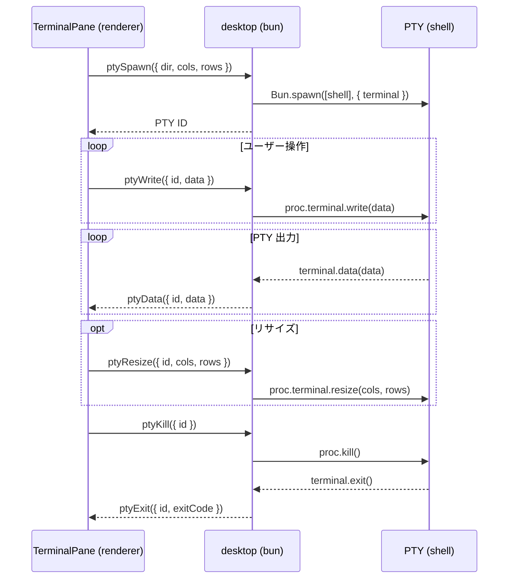

# Terminal

ターミナルエミュレータ。Electrobun RPC 経由で desktop 側の PTY プロセスと通信する。
バックエンドとして xterm.js（デフォルト）と ghostty-web を UI から切り替えられる。

## 構成

```
features/terminal/
├── TerminalPane.vue              # 分割レイアウト管理（フラットレンダリング）
├── TerminalLeaf.vue              # リーフノード（バックエンド切り替え、フォーカス管理）
├── SplitResizeHandle.vue         # 分割リサイズハンドル（ドラッグ）
├── XtermTerminal.vue             # xterm.js バックエンド（デフォルト）
├── GhosttyTerminal.vue           # ghostty-web バックエンド
├── splitTree.ts                  # immutable な分割ツリー操作（split, remove, resize）
├── terminalConfig.ts             # 共通設定（フォント、テーマ）
├── registerTerminalCommands.ts   # 分割・ナビゲーションコマンドの登録
├── useTerminalStore.ts           # worktree ごとの分割レイアウト状態管理（Pinia）
├── useFilePathLinkProvider.ts    # ターミナル出力のファイルパス検出・クリック
├── useSplitResize.ts             # ratio ベースのリサイズ管理
└── useSpatialNavigation.ts       # leaf 間の矩形ベース空間ナビゲーション
```

## PTY ライフサイクル



- shell: `process.env.SHELL` または `zsh`
- cwd: `ptySpawn` の `dir` パラメータ（worktree ごとに異なる）
- 環境変数: `FORCE_HYPERLINK=1` で CLI ツール（Claude Code 等）の OSC 8 ハイパーリンク出力を許可
- UTF-8 デコード: `TextDecoder({ stream: true })` でチャンク分割時のマルチバイト文字化けを防止

## ターミナル分割

バイナリツリー構造で水平・垂直分割を管理する。`splitTree.ts` が immutable なツリー操作を提供する。

```
splitNode（内部ノード）
├── direction: "horizontal" | "vertical"
├── ratio: 分割比率（0〜1）
├── left: SplitNode | LeafNode
└── right: SplitNode | LeafNode

leafNode
└── id: ターミナル ID
```

### フラットレンダリング

`TerminalPane` は `flattenTree()` でツリーを走査し、全 leaf と handle を `position: absolute` で配置する。ツリー変更時に leaf の DOM 再生成が発生しないため、xterm のバッファが維持される。

leaf の存在（ツリー構造）と rect（コンテナサイズ）を分離し、コンテナサイズ未確定時の 0x0 mount を防止する。

### 空間ナビゲーション

`useSpatialNavigation` が各 leaf の矩形位置（rect）から、指定方向の最近傍 leaf を算出する。非表示 worktree の leaf は候補から除外する。

### コマンド

| コマンド                   | 動作                                    |
| -------------------------- | --------------------------------------- |
| `terminal.splitHorizontal` | アクティブ leaf を水平分割              |
| `terminal.splitVertical`   | アクティブ leaf を垂直分割              |
| `terminal.closePane`       | アクティブ leaf を閉じる（PTY も kill） |
| `terminal.focusLeft`       | 左の leaf にフォーカス移動              |
| `terminal.focusRight`      | 右の leaf にフォーカス移動              |
| `terminal.focusUp`         | 上の leaf にフォーカス移動              |
| `terminal.focusDown`       | 下の leaf にフォーカス移動              |
| `terminal.togglePreview`   | プレビューペインの表示切替              |

## Worktree ごとのレイアウト保持

`useTerminalStore`（Pinia）が `layoutsByDir`（`Map<dir, TerminalLayoutState>`）で worktree ごとに分割レイアウトを保持する。

- `visit(dir)` で初回訪問時にレイアウトを作成し、PTY を起動する
- worktree 切り替え時は既存レイアウトを復元する（PTY プロセスと xterm バッファは維持される）
- worktree 削除時は該当 PTY を kill する

### terminalContainer のレイアウト

`MainLayout.vue` の `terminalContainer` は CSS Grid（`grid-template-areas`）で worktree 単位の TerminalPane を配置する。2段構成でレイアウトの責務を分離している。

- **親（terminalContainer）**: `grid-template-areas` / `grid-template-columns` / `grid-template-rows` で worktree をどこに置くかを定義する。動的な値なので `:style` バインディングで設定する
- **子（TerminalPane）**: `:style="{ gridArea }"` でどのエリアに入るかを宣言するだけ。サイズは親 grid が決める
- **TerminalPane 内部**: `flattenTree()` + `position: absolute` で leaf/handle を配置する。再帰的な split ツリーの表現には absolute が適しており、grid-template-areas で管理する親の方針とは矛盾しない

> [!NOTE]
> `grid-template-areas` に含まれない子は自動で非表示にはならない（auto-placement される）。非表示にするには `v-show` が必要

#### 表示モード

- 単一表示（デフォルト）: 1x1 grid でアクティブ worktree のみ表示。非アクティブは `v-show` で非表示（DOM 維持）
- 全表示: `computeTileLayout()` でコンテナのアスペクト比から cols/rows を動的に算出し、NxM grid で全 TerminalPane をタイル配置

### 全表示モード

サイドバーの WORKTREES ヘッダー横のトグルボタンで切り替える。`useTerminalStore.showAll` で状態を管理する。

## ファイルパスリンク

`useFilePathLinkProvider` が xterm の LinkProvider を実装し、ターミナル出力のファイルパスをクリック可能にする。

- 相対パスと絶対パス（`~/` 展開含む）の両方に対応
- Claude Code が改行+インデントで折り返したパスも結合して検出
- パスの直後に `:行番号` が続く場合（`src/main.ts:30` 等）は行番号を抽出
- クリック時にプレビューペインでファイルを表示（行番号付きの場合は該当行にスクロール＋ハイライト）

## バックエンド

| バックエンド | ライブラリ                      | リサイズ方式             | 備考                    |
| ------------ | ------------------------------- | ------------------------ | ----------------------- |
| xterm        | @xterm/xterm + @xterm/addon-fit | 手動 ResizeObserver      | 日本語入力が安定        |
| ghostty      | ghostty-web                     | FitAddon.observeResize() | WASM パーサーで高速描画 |

バックエンド切り替え時は PTY を再生成して新しいターミナルを開く。

## 共通設定（terminalConfig.ts）

- フォント: UDEV Gothic 35NF, Menlo, monospace（13px）
- テーマ: zinc 系ダークテーマ（xterm 背景 `#18181b`）
- ペイン背景: プロジェクト名（repoName）のハッシュから類似色（+30°）の2色グラデーションを生成。非アクティブ leaf は `opacity-50` で背景が透ける
- カーソル: 点滅有効
- ANSI カラーは各バックエンドのデフォルトパレットを使用

## Desktop 側の PTY 管理

- `Map<number, PtyEntry>` で PTY ID → プロセスを管理
- `PtyEntry` は `win`, `worktreeDir`, `decoder` を保持
- ウィンドウ close 時に、そのウィンドウが所有する全 PTY を kill
- worktree 削除時は `worktreeDir` で該当 PTY を特定して kill
- `Bun.spawn({ terminal })` で PTY をネイティブサポート（node-pty 不要）
