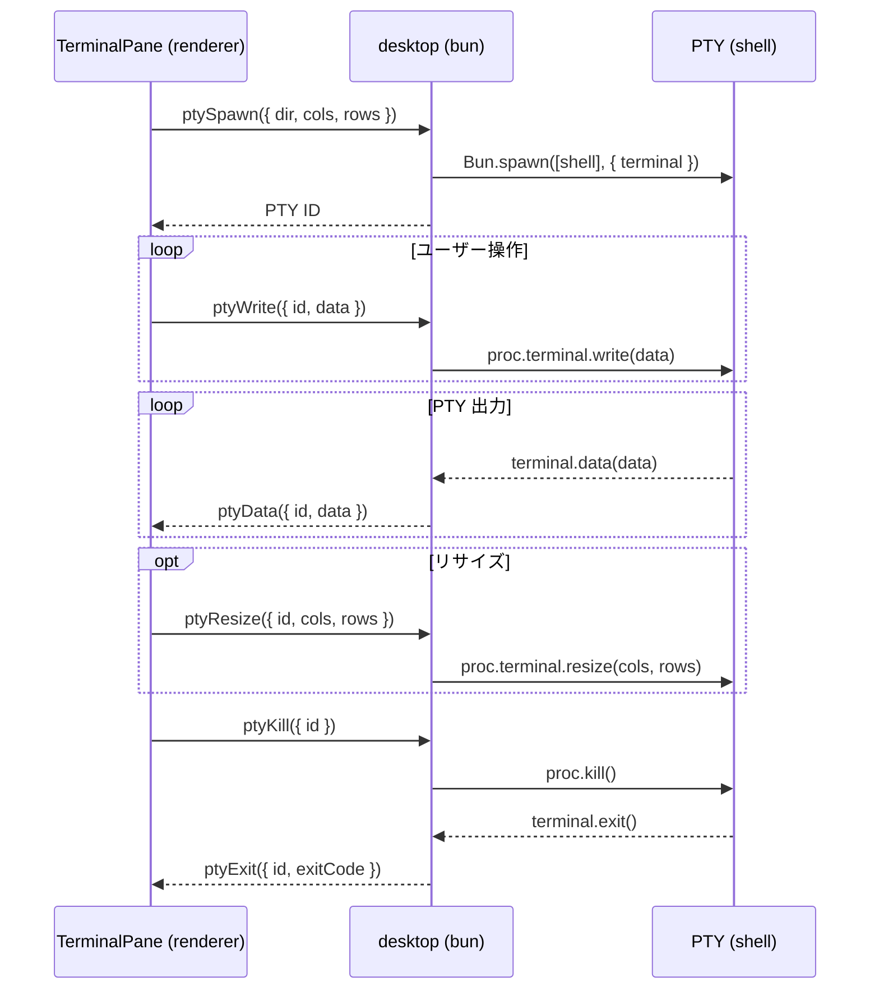

# Terminal

ターミナルエミュレータ。Electrobun RPC 経由で desktop 側の PTY プロセスと通信する。
xterm.js をバックエンドとして使用する。

## 構成

```text
features/terminal/
├── TerminalPane.vue              # （未使用）旧分割レイアウト管理
├── TerminalLeaf.vue              # リーフノード（XtermTerminal ラップ、フォーカス管理）。MainLayout が直接配置
├── SplitResizeHandle.vue         # 分割リサイズハンドル（ドラッグ）
├── XtermTerminal.vue             # xterm.js ターミナルエミュレータ
├── splitTree.ts                  # immutable な分割ツリー操作（split, remove, resize）
├── terminalConfig.ts             # 共通設定（フォント、テーマ）
├── registerTerminalCommands.ts   # 分割・ナビゲーションコマンドの登録
├── useTerminalStore.ts           # worktree ごとの分割レイアウト状態管理（Pinia）
├── useFilePathLinkProvider.ts    # ターミナル出力のファイルパス検出・クリック
├── useSplitResize.ts             # ratio ベースのリサイズ管理
└── useSpatialNavigation.ts       # leaf 間の矩形ベース空間ナビゲーション
```

## PTY ライフサイクル



- shell: `process.env.SHELL` または `zsh`
- cwd: `ptySpawn` の `dir` パラメータ（worktree ごとに異なる）
- 環境変数: `FORCE_HYPERLINK=1` で CLI ツール（Claude Code 等）の OSC 8 ハイパーリンク出力を許可
- UTF-8 デコード: `TextDecoder({ stream: true })` でチャンク分割時のマルチバイト文字化けを防止

## ターミナル分割

バイナリツリー構造で水平・垂直分割を管理する。`splitTree.ts` が immutable なツリー操作を提供する。

```
splitNode（内部ノード）
├── direction: "horizontal" | "vertical"
├── ratio: 分割比率（0〜1）
├── left: SplitNode | LeafNode
└── right: SplitNode | LeafNode

leafNode
└── id: ターミナル ID
```

### CSS Grid レイアウト

`MainLayout` が全 worktree の全 leaf を1つの CSS Grid コンテナでフラットに管理する。`treeToGridTemplate()` が分割ツリーから `grid-template-areas` / `columns` / `rows` を生成し、各 leaf は `grid-area` で配置される。表示モードの切り替えはコンテナの grid-template を変えるだけで済む。

- leaf の DOM は v-show で表示/非表示を制御（xterm バッファは維持される）
- リサイズハンドルは `flattenHandles()` で gap の位置を算出し、absolute overlay で配置

### 空間ナビゲーション

`useSpatialNavigation` が各 leaf の矩形位置（rect）から、指定方向の最近傍 leaf を算出する。非表示 worktree の leaf は候補から除外する。

### コマンド

| コマンド                   | 動作                                    |
| -------------------------- | --------------------------------------- |
| `terminal.splitHorizontal` | アクティブ leaf を水平分割              |
| `terminal.splitVertical`   | アクティブ leaf を垂直分割              |
| `terminal.closePane`       | アクティブ leaf を閉じる（PTY も kill） |
| `terminal.focusLeft`       | 左の leaf にフォーカス移動              |
| `terminal.focusRight`      | 右の leaf にフォーカス移動              |
| `terminal.focusUp`         | 上の leaf にフォーカス移動              |
| `terminal.focusDown`       | 下の leaf にフォーカス移動              |
| `terminal.togglePreview`   | プレビューペインの表示切替              |

## Worktree ごとのレイアウト保持

`useTerminalStore`（Pinia）が `layoutsByDir`（`Map<dir, TerminalLayoutState>`）で worktree ごとに分割レイアウトを保持する。

- `visit(dir)` で初回訪問時にレイアウトを作成し、PTY を起動する
- worktree 切り替え時は既存レイアウトを復元する（PTY プロセスと xterm バッファは維持される）
- worktree 削除時は該当 PTY を kill する

### terminalContainer のレイアウト

`MainLayout.vue` の `terminalContainer` が全 worktree の全 leaf を1つの CSS Grid でフラットに管理する。

- **コンテナ**: `grid-template-areas` / `columns` / `rows` で全 leaf の配置を定義。`:style` バインディングで動的に設定
- **子（TerminalLeaf）**: `grid-area` でどのエリアに入るかを宣言するだけ。サイズはコンテナ grid が決める
- **リサイズハンドル**: `flattenHandles()` で gap 位置を算出し、absolute overlay で配置

> [!NOTE]
> `v-show:false` は `display:none` になるため、非表示の leaf は grid item から外れ auto-placement に影響しない

#### 表示モード

`useTerminalStore.viewMode` で3つのモードを切り替える。

- **wt**（デフォルト）: `treeToGridTemplate()` でアクティブ worktree の分割ツリーから grid-template を生成。非アクティブ leaf は `v-show:false`
- **all**: `tileGridTemplate()` で全 leaf を均等タイル配置
- **claude**: `tileGridTemplate()` で Claude 起動中の leaf のみ均等タイル配置

## ファイルパスリンク

`useFilePathLinkProvider` が xterm の LinkProvider を実装し、ターミナル出力のファイルパスをクリック可能にする。

- 相対パスと絶対パス（`~/` 展開含む）の両方に対応
- Claude Code が改行+インデントで折り返したパスも結合して検出
- パスの直後に `:行番号` が続く場合（`src/main.ts:30` 等）は行番号を抽出
- クリック時にプレビューペインでファイルを表示（行番号付きの場合は該当行にスクロール＋ハイライト）

## 設定（terminalConfig.ts）

- フォント: UDEV Gothic 35NF, Menlo, monospace（13px）
- テーマ: zinc 系ダークテーマ（xterm 背景 `#18181b`）
- ペイン背景: プロジェクト名（repoName）のハッシュから類似色（+30°）の2色グラデーションを生成。非アクティブ leaf は `opacity-50` で背景が透ける
- カーソル: 点滅有効
- ANSI カラーは xterm.js のデフォルトパレットを使用

## スクロール位置保持（xterm.js）

TUI アプリ（Claude Code 等）が normal buffer で動作する場合、スクロールバック中に再描画が起きるとエスケープシーケンスにより viewportY がリセットされる。ネイティブターミナルではコア内部でスクロール位置を管理するためこの問題は起きないが、xterm.js ではコア内部を変更できないため外部から補正する。

### 業界ターミナルの設計

| ターミナル | アンカー方式                             | 行追加時の処理                                           |
| ---------- | ---------------------------------------- | -------------------------------------------------------- |
| alacritty  | `display_offset`（スクロールバック行数） | `scroll_up()` 内で `display_offset += positions`         |
| kitty      | `scrolled_by`（スクロールバック行数）    | render loop で `scrolled_by += history_line_added_count` |
| WezTerm    | `StableRowIndex`（論理行インデックス）   | `stable_row_index_offset` で削除行数を追跡               |

共通点:

- スクロール位置はターミナルコアの内部状態として管理される
- 外部 callback で補正するパターンはどのターミナルにも存在しない

### xterm.js での実装: ViewportIntent + Marker

xterm.js の `registerMarker()` は安定アンカーとして機能し、行の追加・削除に追従する。

```text
ViewportIntent = "bottom" | "anchored(marker)"

write() 前:
  captureViewportIntent()
    → bottom にいる or alternate buffer → intent = bottom
    → スクロールバック中 → Marker を登録して intent = anchored(marker)

write() 後（onWriteParsed で集約）:
  restoreViewportIntent()
    → intent = bottom → scrollToBottom()
    → intent = anchored → marker.line に scrollToLine()
```

`onWriteParsed` はフレームごとに最大1回発火するため、高頻度 write() でも復元が1回に集約される。

### 検討・却下した方式

- **viewportY 生値の共有変数**: xterm.js の非同期 WriteBuffer とスナップショットの対応が崩れる
- **viewportY 生値のローカル変数（クロージャキャプチャ）**: コールバック実行時に古いスナップショットでユーザー操作を踏み潰す
- **scrollRevision（世代番号）**: 業界4大ターミナルのどれにも存在しないパターン

### リサイズ時の挙動

リサイズ時は Marker ベースの復元を試みるが、TUI アプリの SIGWINCH 再描画で Marker 復元後にずれる場合がある。他のターミナル（alacritty, kitty 等）でもリサイズ時は bottom にリセットされるため、許容する。

## Desktop 側の PTY 管理

- `Map<number, PtyEntry>` で PTY ID → プロセスを管理
- `PtyEntry` は `win`, `worktreeDir`, `decoder` を保持
- ウィンドウ close 時に、そのウィンドウが所有する全 PTY を kill
- worktree 削除時は `worktreeDir` で該当 PTY を特定して kill
- `Bun.spawn({ terminal })` で PTY をネイティブサポート（node-pty 不要）
